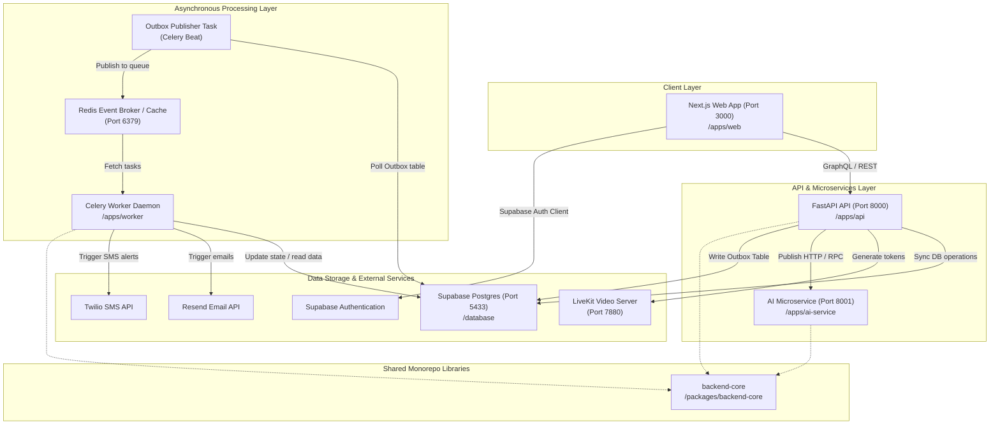
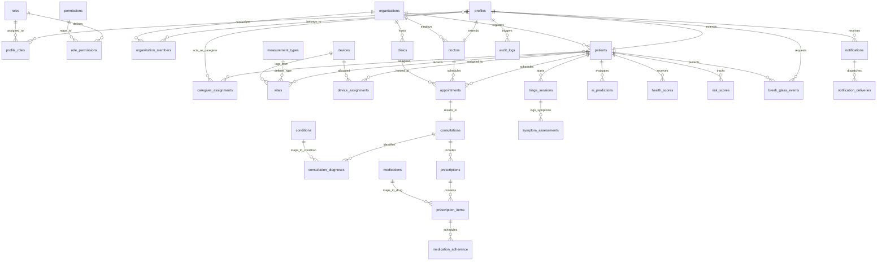
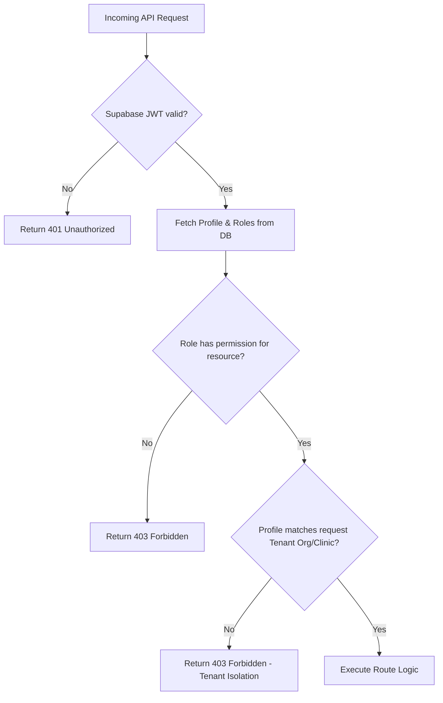
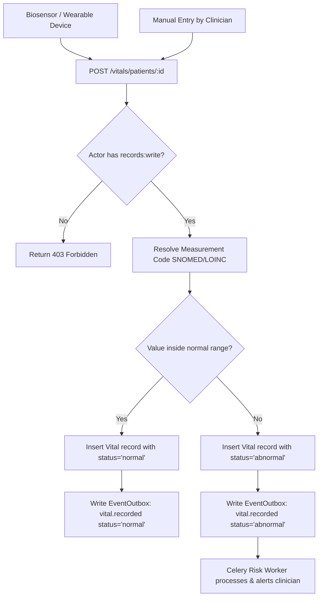
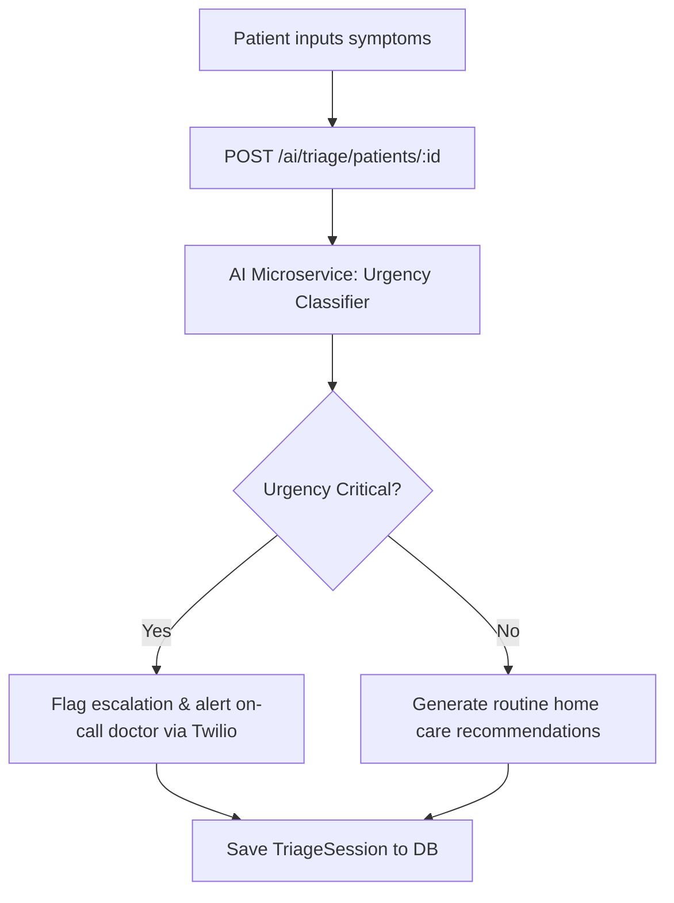
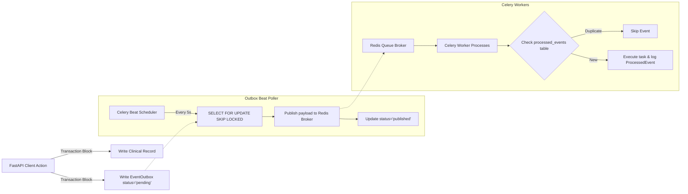

# Mediva Codebase Features & Workflows Report

This report presents a detailed analysis of the Mediva platform's architecture, database models, versioned API routing, event outbox dispatching, background Celery queues, and web user interfaces as currently implemented in the source code.

---

## Table of Contents
1. [System Architecture](#1-system-architecture)
2. [Database Schema (Data Engine)](#2-database-schema-data-engine)
3. [API Service Routing & Handlers (`apps/api`)](#3-api-service-routing--handlers-appsapi)
   - [A. Patient Profile Router (`/patients`)](#a-patient-profile-router-patients)
   - [B. Vitals Ingestion Router (`/vitals`)](#b-vitals-ingestion-router-vitals)
   - [C. Scheduling Router (`/appointments`)](#c-scheduling-router-appointments)
   - [D. Telehealth Consultations Router (`/consultations`)](#d-telehealth-consultations-router-consultations)
   - [E. Prescriptions Router (`/prescriptions`)](#e-prescriptions-router-prescriptions)
   - [F. AI Router (`/ai`)](#f-ai-router-ai)
4. [Background Worker & Task Queues (`apps/worker`)](#4-background-worker--task-queues-appsworker)
5. [AI Microservice Gateway (`apps/ai-service`)](#5-ai-microservice-gateway-appsai-service)
6. [Web Frontend UI (`apps/web`)](#6-web-frontend-ui-appsweb)
7. [Core Event-Driven Workflows](#7-core-event-driven-workflows)

---

## 1. System Architecture

Mediva is organized as a high-performance **Pnpm monorepo** consisting of isolated services and shared libraries:

```text
c:\Users\rohan sai\OneDrive\Desktop\Mediva
├── apps/
│   ├── web/               # Next.js 15 Frontend
│   ├── api/               # FastAPI Backend Service (Uvicorn)
│   ├── ai-service/        # Consolidated AI Microservice (Uvicorn)
│   └── worker/            # Celery Worker Daemon & Beat scheduler
├── packages/
│   ├── backend-core/      # Core Python business models, auth, notifications, and telehealth
│   ├── ui/, auth/, config/# Shared monorepo frontend assets and TypeScript typings
│   └── sdk/, types/, validation/
└── database/
    ├── migrations/        # Alembic schema version history
    └── seed/              # Database mock seeder script
```

### Component Interoperability Flow
The flowchart below outlines the component layout, runtime networking, and communication channels between the Next.js frontend, FastAPI backend, AI microservice, Celery queues, and database engines:



---

## 2. Database Schema (Data Engine)

The schema is defined in [models.py](file:///c:/Users/rohan%20sai/OneDrive/Desktop/Mediva/packages/backend-core/database/models.py) using SQLAlchemy 2.0. The Entity-Relationship Diagram (ERD) below outlines the relationships between these tables:



### Table Definitions & Core Scopes

#### A. Access Control & Multi-Tenancy
* **`profiles`**: Holds user identities.
  - Fields: `id` (UUID), `email` (String, unique, index), `first_name`, `last_name`, `phone`, `photo_url`.
* **`roles`**: System roles (e.g. administrator, doctor, patient).
  - Fields: `id` (UUID), `name` (String, unique, index), `description` (Text).
* **`permissions`**: Fine-grained permissions (e.g., `records:read`, `records:write`).
  - Fields: `id` (UUID), `name` (String, unique, index), `description` (Text).
* **`role_permissions`**: Many-to-many relationship mapping permissions to roles.
  - Foreign Keys: `role_id` (ondelete="CASCADE"), `permission_id` (ondelete="CASCADE").
* **`profile_roles`**: Many-to-many mapping of roles to user profiles.
  - Foreign Keys: `profile_id` (ondelete="CASCADE"), `role_id` (ondelete="CASCADE").
* **`organizations`**: Master tenant entity enabling strict data separation.
  - Fields: `id` (UUID), `name` (String), `status` (String, default "active"), `parent_organization_id` (Self-referential UUID).
* **`clinics`**: Location-level units within an organization.
  - Fields: Inherits optimistic lock tracking (`lock_version`). `organization_id`, `name`, `address` (Text), `timezone` (default "UTC"), `phone`, `status`.
* **`organization_members`**: Link mapping profiles to organizations.
  - Fields: `organization_id`, `profile_id`, `status`.

#### B. Patients & Clinicians
* **`doctors`**: Extends profile details for medical personnel.
  - Fields: `id` (UUID, FK to profiles), `specialty`, `license_number` (unique), `organization_id` (FK to orgs), `consultation_fee` (Numeric), `timezone`, `availability_template` (JSONB), `experience_years`, `license_expiry` (Date), `accepting_patients` (Boolean).
* **`patients`**: Extends profile details for healthcare consumers.
  - Fields: `id` (UUID, FK to profiles), `mrn` (Medical Record Number, unique within organization), `organization_id`, `primary_doctor_id` (FK to doctors), `status`, `date_of_birth` (Date), `gender`, `blood_group`, `height` (Numeric), `weight` (Numeric), `preferred_language`.
  - Constraint: `UniqueConstraint("organization_id", "mrn", name="uq_org_patient_mrn")`.
* **`patient_contacts`**: Emergency contacts.
  - Fields: `patient_id`, `name`, `relationship`, `phone`, `email`, `priority` (Integer), `is_primary` (Boolean).
* **`caregiver_assignments`**: Maps caregivers/family to patients with granular access permissions.
  - Fields: `patient_id`, `caregiver_id` (FK to profiles), `relationship`, `permissions` (JSONB), `approved_by_patient` (Boolean).

---

## 3. API Service Routing & Handlers (`apps/api`)

The FastAPI application maps incoming network requests to database actions, handled via versioned routers under [apps/api/app/api/v1/routers/](file:///c:/Users/rohan%20sai/OneDrive/Desktop/Mediva/apps/api/app/api/v1/routers/).

### Access Control Middleware Flow
Every API endpoint request is subjected to the following authentication and multi-tenancy verification pipeline:



---

### A. Patient Profile Router (`/patients`)
* **`POST /`**: Registers a new patient.
  - Input: `PatientCreate` schema.
  - Logic: Validates age (DOB), writes patient profile record using `PatientService.register_patient`, and registers a transactional outbox event.
* **`GET /{patient_id}`**: Retrieves a single patient's profile.
  - Logic: Runs access check (`verify_patient_access`) to ensure the request actor has permission to read the profile, then fetches database record.
* **`PATCH /{patient_id}`**: Updates profile elements.
  - Input: `PatientUpdate` schema.
  - Logic: Verifies access, validates DOB, and updates columns.
* **`GET /`**: Searches patient records by query.
  - Parameters: `query` (String).
  - Security: Requires permission `records:read`.
* **`GET /{patient_id}/care-team`**: Retrieves active doctors and clinical teams.
* **`GET /{patient_id}/timeline`**: Returns clinical encounters history timeline.

#### Registration Sequence
```mermaid
sequenceDiagram
    actor Admin/Clinician
    participant API as FastAPI Router (/patients)
    database DB as Postgres DB
    participant Outbox as Event Outbox
    
    Admin/Clinician->>API: POST / (Register Patient Profile)
    API->>API: Validate birth_date & mrn
    API->>DB: Insert Profile record
    API->>DB: Insert Patient record (assigned to Org & Primary Doctor)
    API->>DB: Insert EventOutbox (patient.registered)
    API-->>Admin/Clinician: Return Patient profile details
```

---

### B. Vitals Ingestion Router (`/vitals`)
* **`POST /patients/{patient_id}`**: Ingests new sensor/manual vital metrics.
  - Input: `VitalIngest` schema.
  - Security: Requires permission `records:write`.
  - Logic: Resolves measurement type code, logs vital reading, and marks status as `normal` or `abnormal` based on standard ranges.
* **`GET /patients/{patient_id}`**: Queries vital logs.
  - Parameters: `measurement_code` (LOINC code filter), `limit` (max records).
  - Security: Requires permission `records:read`.

#### Vitals Flowchart


---

### C. Scheduling Router (`/appointments`)
* **`POST /`**: Books an appointment slot.
  - Input: `AppointmentCreate` schema (patient, doctor, clinic, scheduled_time, duration).
  - Logic: Books slot using `AppointmentService.booking_service.book_appointment`.
* **`GET /{appointment_id}`**: Fetches appointment details.
* **`PATCH /{appointment_id}/reschedule`**: Updates the scheduled date/time.
* **`DELETE /{appointment_id}`**: Cancels the appointment.
* **`GET /doctors/{doctor_id}/availability`**: Looks up clinical schedule slots.
  - Parameters: `target_date` (Date), `duration_minutes`.
  - Logic: Checks doctor calendar and template, returns free 30/60 minute windows.

#### Scheduling Sequence
```mermaid
sequenceDiagram
    actor Patient
    participant API as FastAPI Router (/appointments)
    database DB as Postgres DB
    participant Outbox as Event Outbox

    %% Availability Check
    Patient->>API: GET /doctors/{id}/availability
    API->>DB: Query doctor template availability & existing bookings
    API-->>Patient: Return free slots (30/60m windows)

    %% Booking
    Patient->>API: POST / (Book slot)
    API->>DB: Check optimistic lock on doctor schedule
    API->>DB: Insert Appointment (status: 'scheduled')
    API->>DB: Insert EventOutbox (appointment.created)
    API-->>Patient: Return Booking confirmation
```

---

### D. Telehealth Consultations Router (`/consultations`)
* **`POST /{appointment_id}/start`**: Creates a LiveKit room and retrieves a JWT participant join token.
  - Security: Requires permission `records:write`.
  - Logic: Starts session via `ConsultationService.start_consultation` and signs an HS256 LiveKit JWT containing permissions (`video: roomJoin: true`).
* **`GET /{appointment_id}`**: Fetches clinical encounter summary and note contents.
* **`PATCH /{appointment_id}`**: Edits soap notes.
  - Input: `ConsultationUpdate` schema (Subjective, Objective, Assessment, Plan notes).
  - Security: Requires permission `records:write`.
* **`POST /{appointment_id}/diagnoses`**: Assigns ICD-10 conditions to the session.
* **`POST /{appointment_id}/complete`**: Finalizes the session.
  - Security: Requires permission `records:write`.
  - Logic: Triggers completion, writes outbox record `consultation.completed` to notify background workers.

#### Telehealth Sequence
```mermaid
sequenceDiagram
    actor Doctor
    participant API as FastAPI Router (/consultations)
    participant LiveKit as LiveKit Server
    database DB as Postgres DB

    Doctor->>API: POST /{appointment_id}/start
    API->>LiveKit: Create Room & request signed participant token
    LiveKit-->>API: Signed HS256 JWT token
    API->>DB: Insert Consultation record (status: 'running')
    API-->>Doctor: Return LiveKit token & session info

    %% Notes Updates
    Doctor->>API: PATCH /{appointment_id} (Update SOAP Clinical notes)
    API->>DB: Update soap_notes (JSONB details)
    API-->>Doctor: Return updated consultation

    %% Diagnoses
    Doctor->>API: POST /{appointment_id}/diagnoses (Add ICD-10 codes)
    API->>DB: Link Condition to Consultation
    API-->>Doctor: Diagnosis added
```

---

### E. Prescriptions Router (`/prescriptions`)
* **`POST /`**: Issues new prescription orders.
  - Input: `PrescriptionCreate` schema (medication IDs, dosages, periods, total days).
  - Security: Requires permission `records:write`.
* **`GET /{prescription_id}`**: Fetches prescription data.
* **`POST /adherence/{adherence_id}/log`**: Logs drug administration events.
  - Input: `MedicationAdherenceLog` schema (status e.g. taken/missed, logged_time, notes).

#### Prescriptions Sequence
```mermaid
sequenceDiagram
    actor Doctor
    participant API as FastAPI Router (/prescriptions)
    database DB as Postgres DB
    participant Outbox as Event Outbox
    participant Beat as Outbox Beat Task
    participant Worker as Celery Worker

    Doctor->>API: POST / (Issue prescription details)
    API->>DB: Insert Prescription & items (drug, quantity, schedules)
    API->>DB: Write EventOutbox (prescription.created)
    API-->>Doctor: Prescription saved
    
    Beat->>DB: Poll outbox, mark as published
    Beat->>Worker: Dispatch prescription.created event
    
    Note over Worker: Prepopulate Adherence compliance logs
    Worker->>DB: Calculate dose times for each drug over duration_days
    Worker->>DB: Insert MedicationAdherence calendar logs (status: 'pending')
```

---

### F. AI Router (`/ai`)
* **`POST /triage/patients/{patient_id}`**: Registers a patient self-triage diagnostic query.
  - Input: `TriageSessionCreate` (symptoms, duration).
* **`POST /predictions/patients/{patient_id}`**: Triggers predictive model generation.
  - Input: `AIPredictionCreate` (prediction type, e.g. re-admission risk).
  - Security: Requires permission `records:write`.
  - Logic: Resolves data, triggers risk scores calculation.

#### AI Triage Flow


---

## 4. Background Worker & Task Queues (`apps/worker`)

The worker application runs Celery processes coordinated by a Redis broker. The pipeline below outlines how transactional database writes are dispatched to Redis and consumed idempotently by background workers:



### A. Transactional Outbox Publisher (`outbox_publisher.py`)
- **Action**: Periodically polled by Celery Beat (default: every 5 seconds).
- **Core Query**:
  ```sql
  SELECT id, event_type, payload, retry_count, max_retries
  FROM event_outbox
  WHERE status = 'pending'
    AND (next_retry_at IS NULL OR next_retry_at <= NOW())
  ORDER BY created_at ASC
  LIMIT 50
  FOR UPDATE SKIP LOCKED;
  ```
- **Description**: Ensures **at-least-once event delivery**. Reads pending outbox entries, publishes the payloads onto the Redis Broker via `CeleryEventBus.publish()`, and marks records as `published`. If publishing fails, updates with an exponential backoff schedule (`[1m, 5m, 15m, 1h, 4h]`). If max retries are exceeded, moves records to a dead-letter state (`failed`).

### B. AI Pipeline Worker (`ai_worker.py`)
- **Subscribes to**: `consultation.completed`
- **Actions**:
  - Validates event idempotency against `processed_events`.
  - Logs event type and retrieves consultation data.
  - Triggers clinical summary generation (calls Gemini/Groq LLMs to produce SOAP notes summaries, then computes embeddings and indexes them to the vector store).

### C. Notification Dispatcher (`notification.py`)
- **Subscribes to**: `appointment.created`, `appointment.cancelled`, `consultation.completed`, `prescription.created`, `risk.generated`.
- **Actions**:
  - Dedupes event payloads.
  - Generates multi-channel notifications.
  - Routes traffic to appropriate delivery clients: **MockTwilioProvider** for SMS, Firebase Cloud Messaging (**MockFCMProvider**) for mobile pushes, and **Resend** APIs for clinical summary emails.

### D. Adherence and Reminders Planner (`reminder.py`)
- **Subscribes to**: `appointment.created`, `appointment.rescheduled`, `prescription.created`.
- **Actions**:
  - **Compliance Calendaring**: Upon receiving `prescription.created`, generates compliance records in `medication_adherence` containing dates and times for each dose based on frequency intervals.
  - **Appointment Alerts**: Schedules 24h and 1h alerts for upcoming doctor visits.
  - **Reschedules**: Cancels old reminder entries and creates new ones.

### E. Health Score & Clinical Risk Evaluator (`risk_worker.py`)
- **Subscribes to**: `vital.recorded`
- **Actions**:
  - Scans for `abnormal` vitals flags.
  - Triggers a background risk re-evaluation task that runs deterministic medical scoring matrices and inserts the results to `risk_scores` and `health_scores` tables.

### F. Cron Schedulers & Cleaners (`beat.py` & `cleanup.py`)
- **Actions**:
  - Triggers nightly database analytics and metrics aggregations (`analytics.py`).
  - Clears expired tokens and database logs (`cleanup.py`).

---

## 5. AI Microservice Gateway (`apps/ai-service`)

The AI service operates as an independent FastAPI service on port `8001`.

- **Entry Point**: [main.py](file:///c:/Users/rohan%20sai/OneDrive/Desktop/Mediva/apps/ai-service/main.py) registers routers for core AI capabilities.
- **Routing**: [gateway/router.py](file:///c:/Users/rohan%20sai/OneDrive/Desktop/Mediva/apps/ai-service/gateway/router.py) exposes the `/ai/triage` endpoint.
- **Consolidation**: Folder blocks exist for `triage`, `anomaly`, `report`, `embeddings`, `medication`, and `rag` to isolate classification pipelines and OCR scanners.

---

## 6. Web Frontend UI (`apps/web`)

The Next.js 15 application is located in `apps/web/`.

- **Core Page Layout**: [page.tsx](file:///c:/Users/rohan%20sai/OneDrive/Desktop/Mediva/apps/web/src/app/page.tsx) is a styled medical landing page detailing:
  - Remote patient monitoring portals.
  - Telehealth configurations.
  - AI diagnostics modules.
- **Infrastructure Connectors**:
  - [firebase.ts](file:///c:/Users/rohan%20sai/OneDrive/Desktop/Mediva/apps/web/src/lib/firebase.ts) initializes Firebase Client connections.
  - [FirebaseInitializer.tsx](file:///c:/Users/rohan%20sai/OneDrive/Desktop/Mediva/apps/web/src/components/FirebaseInitializer.tsx) mounts the initialization scripts at the top level of the React tree.

---

## 7. Core Event-Driven Workflows

### Telehealth & Prescription Lifecycle Sequence
This sequence details how appointments are scheduled, telehealth consultations are initialized with LiveKit JWTs, SOAP notes are written, and background tasks automatically generate compliance logs and client SMS notifications:

```mermaid
sequenceDiagram
    autonumber
    actor Patient as Patient Client
    actor Doctor as Doctor (Clinician)
    participant API as FastAPI Backend (apps/api)
    participant LiveKit as LiveKit Server
    database DB as Postgres Database
    participant Beat as Outbox Beat Task
    participant Redis as Redis Queue Broker
    participant Worker as Celery Worker

    %% Booking
    Patient->>API: POST /appointments/ (Book slot)
    API->>DB: Insert Appointment (status: 'scheduled')
    API-->>Patient: Return Appointment details

    %% Consultation Starts
    Doctor->>API: POST /consultations/{appointment_id}/start (Start Room)
    API->>LiveKit: Check room and fetch participant token
    LiveKit-->>API: Signed HS256 Token
    API->>DB: Insert Consultation record (status: 'running')
    API-->>Doctor: Return LiveKit token & session room info
    API-->>Patient: Return LiveKit token (via socket/pull)
    Note over Patient, Doctor: Active video consultation session

    %% Notes and Prescription
    Doctor->>API: PATCH /consultations/{appointment_id} (Update SOAP Notes)
    API->>DB: Update soap_notes column
    Doctor->>API: POST /prescriptions/ (Issue medication)
    API->>DB: Insert Prescription & Prescription Items

    %% Session Completed
    Doctor->>API: POST /consultations/{appointment_id}/complete (Finish visit)
    Note over API: Start DB Transaction
    API->>DB: Update Consultation & Appointment status -> 'completed'
    API->>DB: Write EventOutbox record (type: 'prescription.created')
    API->>DB: Write EventOutbox record (type: 'consultation.completed')
    Note over API: Commit DB Transaction
    API-->>Doctor: Return 200 OK (Encounter saved)

    %% Asynchronous Processing
    loop Every 5 seconds
        Beat->>DB: Poll EventOutbox (where status = 'pending')
        DB-->>Beat: Return event rows
        Beat->>Redis: Publish Event payload ('prescription.created', etc.)
        Beat->>DB: Mark Outbox record status = 'published'
    end

    Redis->>Worker: Consume 'prescription.created'
    Note over Worker: Check idempotency (processed_events table)
    Worker->>DB: Compute compliance calendar times over duration_days
    Worker->>DB: Bulk insert MedicationAdherence schedule rows
    Worker->>DB: Trigger Notification templates (emails, Twilio SMS)
    Worker-->>Patient: Send notification alerts
```
